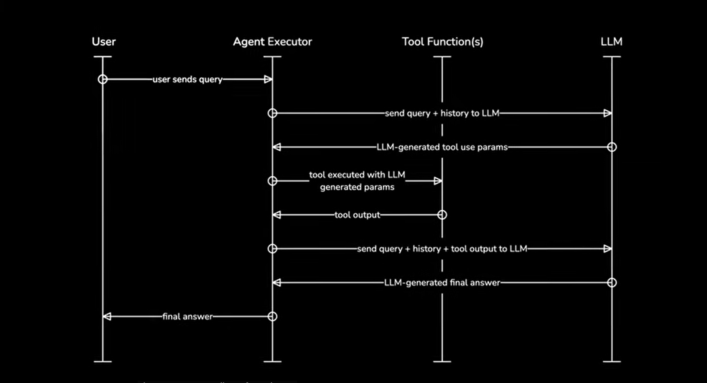
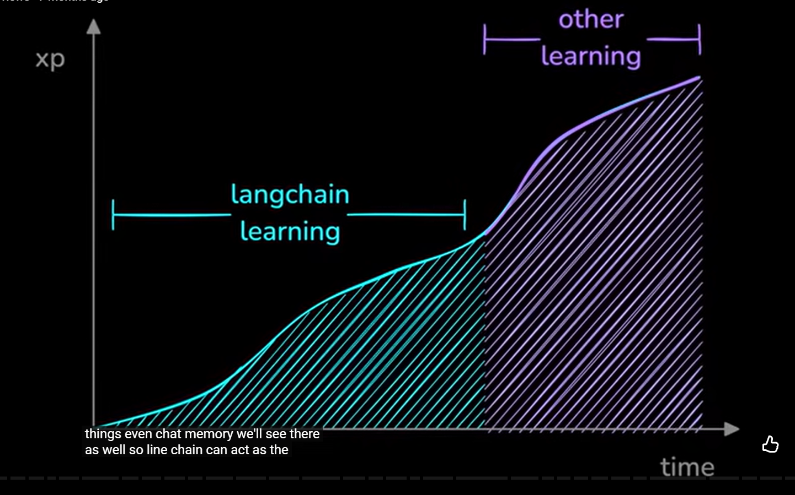

## WHEN TO USE LANGCHAIN
The first question we should ask ourselves is whether we need a framework at all. AI software can be built with very little AI. Building a chatbot app will primarily be standard engineering work with very little AI knowledge required. You can get by just calling a simple API like those provided by OpenAI, Anthropic, or Mistral, and that's all the AI you need.

```python
from openai import OpenAI

client = OpenAI()

completion = client.chat.completions.create(
    model="gpt-4o",
    messages=[
        {"role": "user", "content": "this is all we need huh?"}
    ]
)
```

Beyond the few lines of code above, we don't always need much else. However, that can change very quickly when we start talking about agents, Retrieval Augmented Generation (RAG), and other more complex use cases. More complex use cases require that an engineer either spends a long time learning the intricacies of these techniques, or uses a framework that abstracts the details away from them.

The world is integrating AI into software at an incredibly high pace. We're collectively weaving AI into every industry imaginable. Because of this, most engineers building with AI do not necessarily come from an AI or Machine Learning (ML) background, and very few of those engineers are all-in on AI; most are maybe working on some AI-related projects and committing 5-10% of their time to the space.

In that scenario, it's not realistic for an engineer to learn the intricacies of these techniques quickly enough for a company to see and gain value in the retraining process. That is where a framework like LangChain becomes valuable. LangChain and other frameworks focus on abstracting away the details and providing a set of solutions that mostly work out-of-the-box.

So if an engineer who is new to the space is looking to build with AI, and what they're building is more complex than a simple chatbot — frameworks are often a good idea.

## If I Want to Learn, Should I Skip LangChain?
We've clarified that new engineers working on semi-complex AI projects should start with a framework. However, does that still apply if that engineer wants to advance beyond being a "beginner" AI engineer?

LangChain, in particular, can be a good framework to work with during the initial learning phase. As we better understand the framework, we can gradually reduce the level of abstraction we're using. This gradual move towards explicit code vs high-level abstraction is something that we work on as we work through the AI Engineer's Guide to LangChain.

During the course, we begin with the absolute basics of LangChain, which are the most abstract parts of the framework. For example, when teaching how to build an agent, we begin with the simplest method, which is just a few lines of code. But after this, we learn how to construct our own highly custom agent, which requires a much better understanding of the internals of agents.


With that in mind, LangChain can be a good on-ramp to AI engineering even when your destination is beyond LangChain. Many AI engineers with more experience move on to LangGraph as a framework of choice.

LangGraph allows for far more flexibility but requires a better understanding of the various AI intricacies. So, for many engineers, LangChain is their path to LangGraph, which conveniently uses various LangChain components. This dependency between LangChain and LangGraph means the learning experience of LangChain can provide engineers with hands-on experience and theoretical knowledge that is still highly relevant when switching to LangGraph.

## Do Experienced Engineers Drop LangChain?
As engineers gain more experience, they may move on to other frameworks or drop frameworks altogether. But this is not always the case. At Aurelio AI, almost everything we build is AI-centric, and we work with a variety of frameworks and non-frameworks. Those frameworks often include LangGraph, which uses a core set of LangChain components. LinkedIn also uses LangChain heavily in its "GenAI stack" [1].

We find that engineers who have worked with and understood LangChain well may move on from using it as frequently but tend to return to it when their project requirements line up with what LangChain is good at, i.e., building fast with reasonable abstraction.

## Should I Use LangChain?
LangChain abstracts a lot, making it ideal for engineers new to the space or experienced engineers wanting to build a specific solution fast.

The abstraction of LangChain is both a strength and a weakness. With more experience, those abstractions can feel limiting. That is why we believe LangChain is perfect to get started with, but as a project grows in complexity or the engineer becomes more experienced, they may find themselves moving on to other frameworks.

In both scenarios, sticking with LangChain or moving on from it — LangChain remains a core part of the AI engineer's toolkit. Sticking with LangChain requires you to learn the framework and concepts well. Moving on from LangChain requires that you learn the framework and concepts well enough to be able to build without abstractions.

